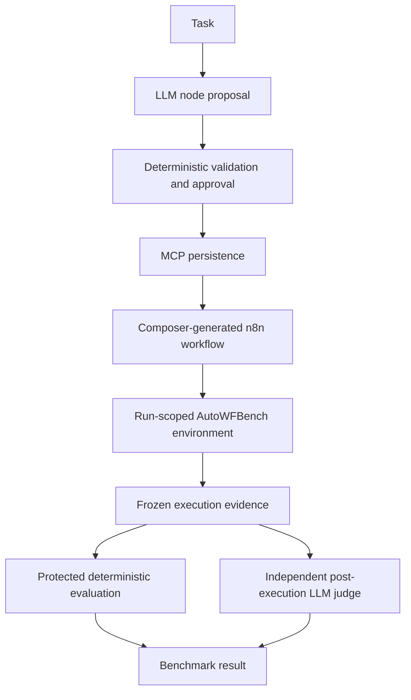

# AI Workflow Composer v2

An incremental LLM workflow composer that uses n8n as persistent workflow state
through MCP. Its generated workflow executes against a fresh AutoWFBench
environment, and the benchmark independently evaluates the resulting evidence.



## Verified results

| Run | n8n execution | Calls | Deterministic | LLM | Final score |
|---|---:|---:|---:|---:|---:|
| `run-95287e5a699f440b9cb2116bba4f8b87` | 105 | 5 | 6/6 | Not configured | Pending |
| `run-5b14bed92683426a905d8879aa799334` | 106 | 5 | 6/6 | 0.66/4 | **6.66/10** |

Both runs passed all four protected deterministic checks and had
`execution_pass: true`. The full judged run used `gpt-6-sol` through the existing
AutoWFBench Codex judge. Its summary incorrectly claimed the EUR branch was
removed, although the recorded patch only corrected argument order. That
reporting error reduced the semantic score. No favorable rerun was substituted.

The capability sequence was `incident.read → source.read → tests.run →
checkout.patch → tests.run`; tests failed before the repair and passed afterward.
The patch was derived by the runtime model from observed evidence, not embedded
as a fix in the Composer.

See [integration findings](docs/integration.md), [setup](docs/setup.md), and
[sanitized result records](docs/results/). These records are derived summaries;
full frozen logs remain in the local benchmark artifacts.

## Repository contents

- `composer/`: workflow models, capability contracts, incremental LLM planner,
  prompts, and deterministic validation.
- `adapters/`: n8n translation and the linear benchmark workflow compiler.
- `mcp_client/`: n8n MCP read/update/publish integration.
- `runtime_service.py`: evidence-based argument and summary transforms.
- `run_integrated_demo.py`: original entry point, now using the benchmark runner.
- `integrations/autowfbench/`: candidate solution bridge and manifest.
- `tests/`: offline Composer tests.
- `development/`: original exploratory scripts, retained for reference. Some
  contact live services or alter workflows; they are not run by default tests.

AutoWFBench is an external, unchanged dependency. Its source, scorecards,
protected fixtures, credentials, and judge prompts are not included here.
The old AutoWFBench composer is not used.

## Quick start

Use Python 3.11 or later:

```sh
python3 -m venv .venv
.venv/bin/python -m pip install -r requirements-dev.txt
cp .env.example .env
# Fill in your Groq key and n8n MCP endpoint/token locally.
.venv/bin/python -m pytest
```

Follow [setup](docs/setup.md) before executing a real benchmark. The current
integration targets the existing workflow `EQvN9tFGuFCotDS1`; it does not bootstrap
an unrelated workflow. Publication updates that workflow.

## Current limitations

This is a verified local integration, not a general production workflow system.
The compiler supports one connected linear graph; the runtime service and
solution bridge must be running locally. End-to-end runs require external n8n,
Groq, AutoWFBench, and (for semantic judging) authenticated Codex services.

The summary transform can misstate a repair despite correct execution. Recorded
results demonstrate this limitation; judge feedback has not been fed into the
candidate to optimize the reported score. Authentication hardening, concurrent
run controls, and broader graph support remain future work.
